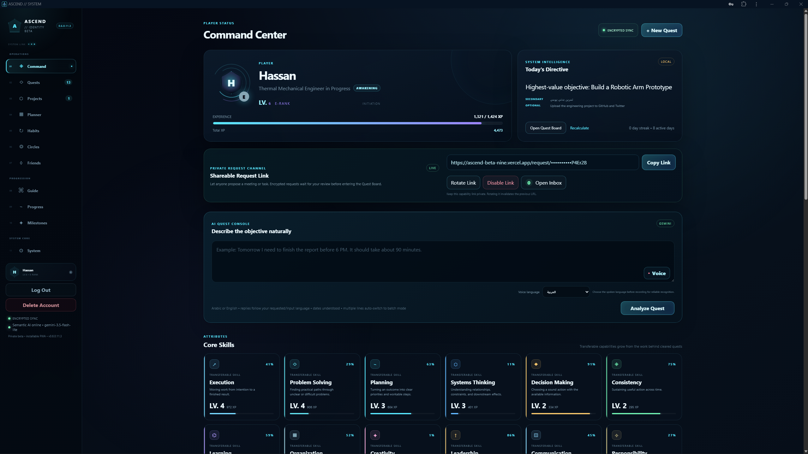
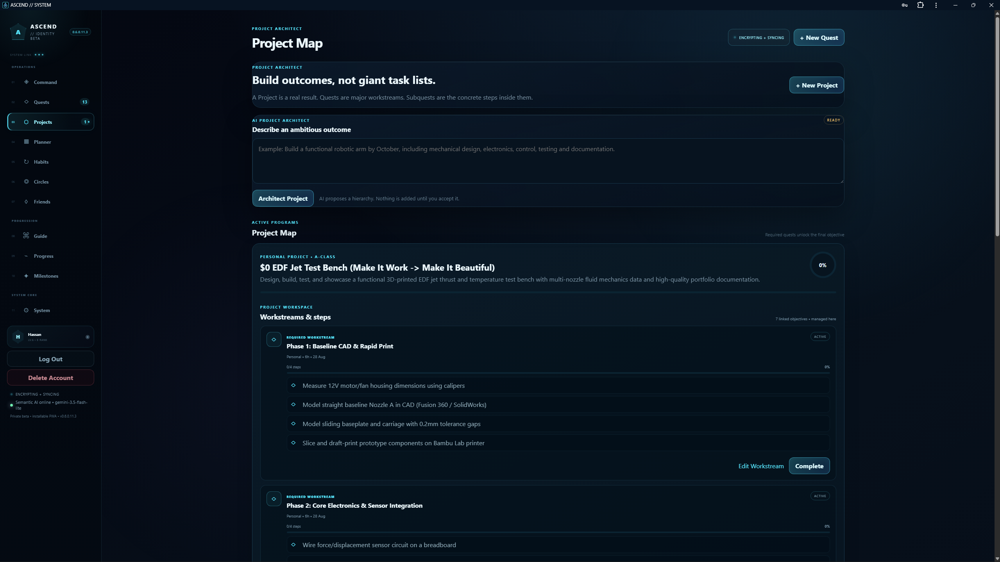
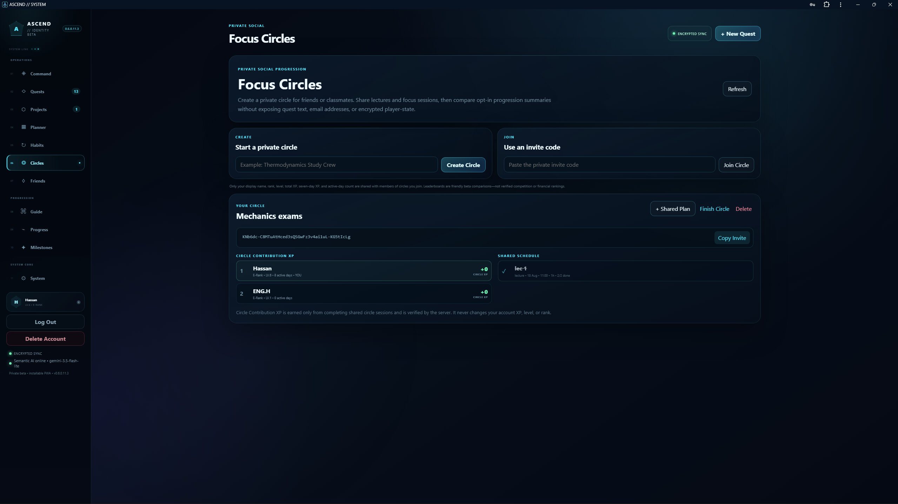
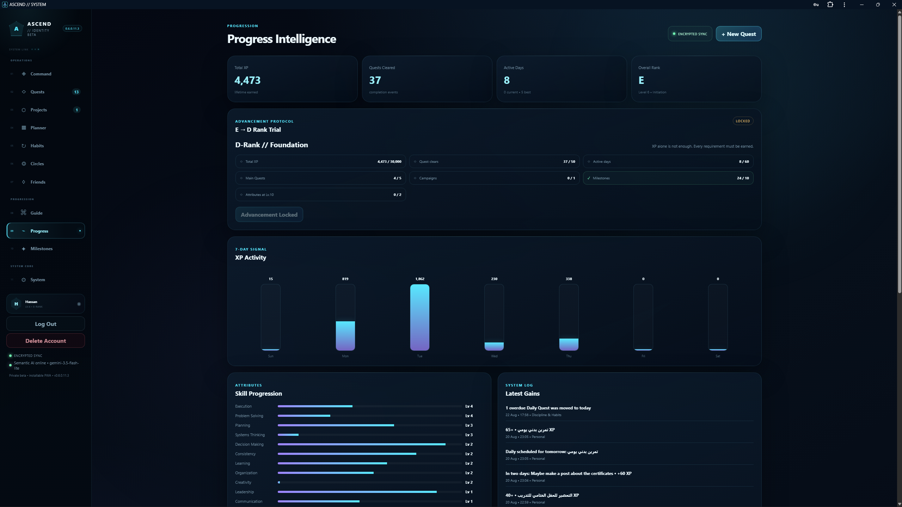

# 🌌 ASCEND // Personal Progression OS
### *A custom-built, privacy-first productivity and progression ecosystem built entirely through AI-Driven Development (Vibe Coding).*

-blue?style=for-the-badge)
-purple?style=for-the-badge)

[The Journey](#-the-vibe-coding-journey) • [Project Structure](#-project-structure--architecture) • [Comprehensive Module Breakdown](#-comprehensive-system-modules-page-by-page) • [System Integrity](#-system-integrity-what-grants-xp) • [Security Vault](#-security--cryptography-the-client-side-vault) • [Local Setup](#-local-development--setup)

---

## 🚀 The Vibe Coding Journey

I don't write traditional code by hand. I built **ASCEND** entirely through **AI-Driven Development (Vibe Coding)**, acting as the systems architect and product manager while guiding AI to write the code. 

Starting from a personal struggle with procrastination and the limits of expensive, rigid productivity apps, I wanted a custom ecosystem. What began as a simple task parser evolved into a massive, highly secure Progressive Web App (PWA) featuring client-side encryption, database security policies, and an advanced RPG progression model scaled up to **S-Rank (S1 through S5)**.

---

## 📁 Project Structure & Architecture

To keep the codebase clean and manageable through AI prompting, the project avoids heavy frameworks and uses modular Vanilla ES6 JavaScript paired with a serverless backend:

`ASCEND/`
*   `api/`                  # Serverless API routes (Vercel edge functions)
*   `public/`               # Frontend assets & core JS modules
    *   `app.js`            # Main application boot & state handler
    *   `planner-system.js` # Semesters, lists, and timetables
    *   `habit-system.js`   # Daily rhythm & consistency tracking
    *   `skill-system.js`   # Attributes & core skills tracking
    *   `state-scope.js`    # Local storage & guest namespace isolation
*   `supabase/`             # Database schemas, migrations, and security SQL audits
*   `tests/`                # Automated smoke tests for system health
*   `server.mjs`            # Local Node.js server middleware
*   `start-windows.bat`     # Automated startup scripts

---

## 🏛️ Comprehensive System Modules: Page-by-Page Breakdown

ASCEND is partitioned into an intuitive command rail designed to minimize friction and maximize execution clarity:

### 1. 🎛️ Command Center (The Main Cockpit)
* **Player Status HUD:** Displays your identity badge, active specialization (e.g., Thermal Mechanical Engineer in Progress), current Level, and Rank tier alongside lifetime XP progress.
* **Today's Directive:** Surfaces your single highest-value objective for the day to eliminate morning decision fatigue.
* **Encrypted Shareable Request Channel:** Generates a secure, hashed link allowing outside peers to propose tasks or meetings directly to your private inbox via hybrid encryption.
* **AI Quest Console (Gemini Engine):** Bilingual natural language intake. Type or use voice recording; the AI handles classification, duration estimation, and subquest generation.
* **Core Skills Matrix (Attributes):** Real-time tracking of transferable capabilities (*Execution, Problem Solving, Planning, Systems Thinking, Decision Making, Consistency, etc.*) that grow organically through verified work.

> 

---

### 2. 📋 Quest Board (Quest Management)
* **Operational Lanes:** Filter seamlessly across Daily Protocols, Main Objectives, Side Quests, Campaigns, and Boss tiers.
* **Dated Daily Protocols:** Unfinished daily items automatically reconcile to the current local date while preserving partial checklist progress.
* **The "Undo Today" Safeguard:** Accidental check-ins can be mathematically reversed to keep progression records completely honest.
* **System-Locked Reward Fields:** Input fields for difficulty, priority, and time lock instantly upon analysis or quick-add to block manual XP inflation.

> 

---

### 3. 🗺️ Projects (Project Map & Architect)
* *“Build outcomes, not giant task lists.”* Breaks multi-week objectives into structured Workstreams (Quests) and concrete tactical steps (Subquests).
* **AI Project Architect:** Feeds ambitious outcomes into the engine to draft a complete work breakdown structure for your review.

> 

---

### 4. 📅 Planner & Semester Engine (The XP-Free Zone)
* **Structured Lists & Semesters:** Manage course codes, target levels, reading queues, and preparation checklists.
* **7-Day Class & Commitment Timetable:** A visual grid tracking lectures, work blocks, and study periods with built-in overlap highlighting.

### 5. 🌱 Habits (Personal Rhythms & Consistency)
* Built for repetitive daily routines (hydration, reading, fitness) separated from main quest progression. Features 7-day rolling viewports, custom frequency selectors, reminder windows, and streak counters.

### 6. 🤝 Circles & Friends (Private Social & Focus Networks)
* **Private Focus Circles:** Create study groups via token invites to collaborate on shared sessions. Uses an isolated **Circle Contribution XP** system computed server-side from actual duration and capped daily to prevent farming.
* **Private Friends Network:** Connect via secure private codes (no public discovery) to coordinate tasks via a dedicated coordination-only shared board.

> 

---

### 7. 📊 Progress, Guide & System (Intelligence & Configuration)
* **Progress Intelligence:** 7-day XP activity histograms, clear counts, active days, and strict multi-variable Advancement Protocols.
* **Progression Guide (Quest Tree):** A visual RPG map unlocking branches (*System Foundation, University Route, Career Route, Engineering Route*).
* **System Configuration:** Manages profile identity, active seasons, cloud sync vault keys, guided onboarding tours, notification centers, and a direct developer **Feedback & Development** channel.

> 

---

## ⚖️ System Integrity: What Grants XP?

ASCEND enforces a strict boundary between planning, organizing, and executing:

| Operational Action | Grants Account XP? | Affects Rank? | Description |
|----------------|:---:|:---:|-------------|
| **Completing a Main/Side Quest** | ✅ Yes | ✅ Yes | Core progression based on AI-verified effort and difficulty. |
| **Completing a Subquest** | ✅ Yes | ✅ Yes | Incremental verified progress toward a larger Project milestone. |
| **Adding items to Planner** | ❌ No | ❌ No | Planning is a structural tool, not an execution of work. |
| **Checking off a Habit** | ❌ No | ❌ No | Personal rhythm consistency tracking only. Zero XP awarded. |
| **Focus Circle Activity** | 🟡 Isolated Only | ❌ No | Grants isolated *Circle Contribution XP* for group metrics only. |
| **Friends Shared Board** | ❌ No | ❌ No | Collaboration coordination only; preserves pure single-player integrity. |

---

## 🛡️ Security & Cryptography (The Client-Side Vault)

* **Client-Side Vault Encryption (AES-256-GCM):** Data is encrypted directly inside the browser using authenticated encryption before uploading to the cloud, ensuring the Supabase backend stores strictly ciphertext.
* **The Recovery File Mechanism:** Because data is client-encrypted, the server holds zero decryption keys. New devices require your immutable `.txt` Recovery File to unlock the vault.
* **Row-Level Security & Turnstile:** Strict Supabase RLS isolation rules backed by Cloudflare Turnstile bot protection across all authentication gates.

---

## ⚙️ Local Development & Setup

ASCEND supports full local deployment for testing the encrypted vault and offline PWA capabilities.

### Installation & Run Instructions
1. **Clone the repository:**
   `git clone https://github.com/YOUR-USERNAME/ascend-system.git`
   `cd ascend-system`
2. **Install Dependencies:**
   `npm install`
3. **Environment Configuration:**
   Copy `.env.example` to `.env.local` and add your Supabase and Gemini keys.
4. **Database Setup:**
   Run the included SQL migrations in your Supabase SQL Editor (`schema.sql` followed by feature/security patches).
5. **Run the Local Server:**
   * **Windows:** Double-click `start-windows.bat`
   * **Mac/Linux:** Run `bash start-mac-linux.sh`

---

<i><b>System Status: Private Beta</b> 
Built to demonstrate that complex, secure, and gamified productivity ecosystems can be fully architected and engineered through AI-Driven Development.</i>

